# Deep Reinforcement Learning Continuous Control
## OVERVIEW
##### Wednesday, July 2, 2020

The report is for Udacity Deep Reinforcement learning course to train an agent to solve [Reacher](https://github.com/Unity-Technologies/ml-agents/blob/master/docs/Learning-Environment-Examples.md#reacher) environment. The goal is to maintain the double-jointed arm's position at the target location for as many time steps as possible. It's "continuous control" task.

## Algorithm
I implement the Deep Deterministic Policy Gradients (DDPG) algorithm following [Continuous control with deep reinforcement learning](https://arxiv.org/pdf/1509.02971.pdf)

<div align="center">
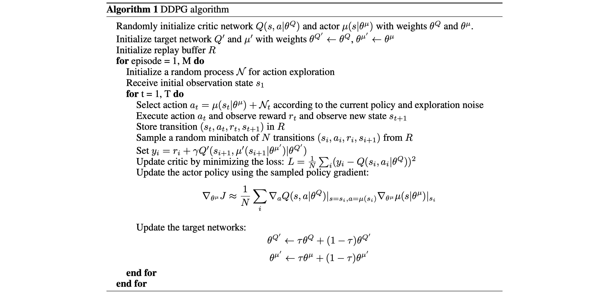
</div>
<div align="center">
<u> **Figure 1** </u>: **Pseudocode**<br>  
</div>

The neural network model as 'actor' and 'critic'. The actor here is used to approximate the optimal policy deterministically. The actor is basically learning the argmax_a Q(s,a) which is best action. The critic learns to evluate the optimal action value function by using the actors best believed. 
```python
# ---------------------------- update critic ---------------------------- #
# Get predicted next-state actions and Q values from target models
actions_next = self.actor_target(next_states)
Q_targets_next = self.critic_target(next_states, actions_next)
# Compute Q targets for current states (y_i)
Q_targets = rewards + (gamma * Q_targets_next * (1 - dones))
# Compute critic loss
Q_expected = self.critic_local(states, actions)
critic_loss = F.mse_loss(Q_expected, Q_targets)
# Minimize the loss
self.critic_optimizer.zero_grad()
critic_loss.backward()
self.critic_optimizer.step()
```

<div align="center">
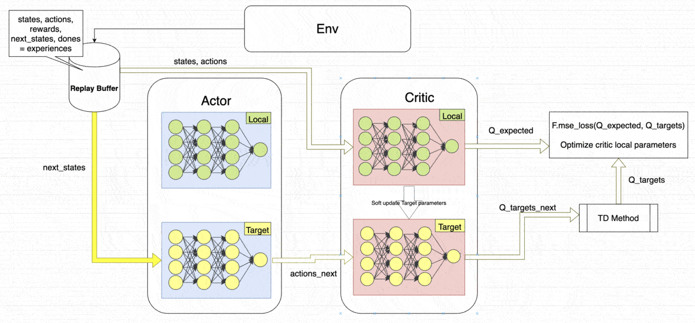
</div>
<div align="center">
<u> **Figure 2** </u>: **Update Critic**<br>  
</div>

It is a kind of an actor-critic method. it could be seen as approximate DQN instead of an actual actor-critic. The reason for this that the critic in DDPG is used to approximate the maximizer over the Q-Value of the next state and not as a learned baseline when updating the actor-local.  I used the DDPG-Bipedal project as the baseline to implement actor-critic method.

```python
# ---------------------------- update actor ---------------------------- #
# Compute actor loss
actions_pred = self.actor_local(states)
actor_loss = -self.critic_local(states, actions_pred).mean()
# Minimize the loss
self.actor_optimizer.zero_grad()
actor_loss.backward()
self.actor_optimizer.step()
```

<div align="center">
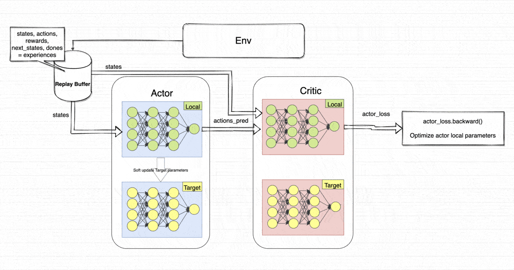
</div>
<div align="center">
<u> **Figure 2** </u>: **Update Actor**<br>  
</div>

## Neural network model

I changed  "WEIGHT_DECAY = 0 ", it is to prevent overfitting and setting weights too big. Then I structured the neural network model. Used two computers and a AWS to find the best network config for this task. The [Batch Normalization](https://arxiv.org/pdf/1502.03167.pdf) technology could accelerate Deep Network Training. So I defined "nn.BatchNorm1d" between each layer. Other [material](https://kratzert.github.io/2016/02/12/understanding-the-gradient-flow-through-the-batch-normalization-layer.html) That I referred to. 

When I structured the model, I referred to some methods of supervised learning to explore the setting.

<div align="center">
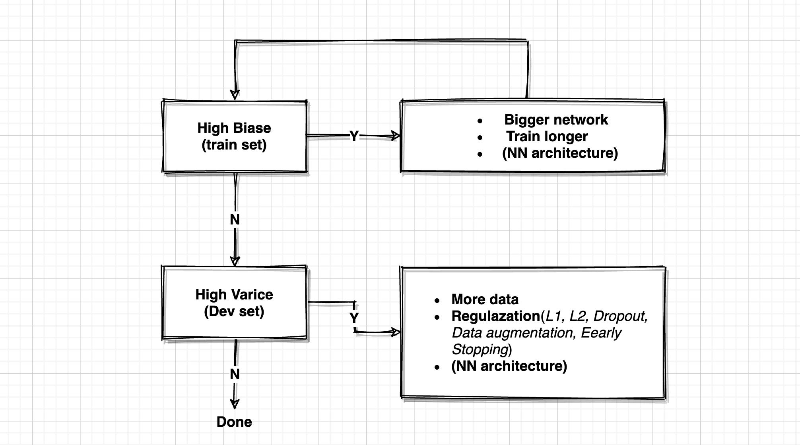
</div>
<div align="center">
<u> **Figure 4** </u>: **Supervise learning**<br>
</div>


I trained the model with different config on three machines. So Test data is marked as coming from AWS, Windows, Mac.

#### From AWS :

* 1 The model converges very slowly , So I would reduce the number of units.

|  NN       |   fc1_units      | fc2_units   | fc3_units | output_layer |
|------------|------------------|-------------|-----------|--------------|
|  Actor     |  512             | 512         |  512      | 4            |
|  Critic    |  512             | 512         |  512      | 1            |

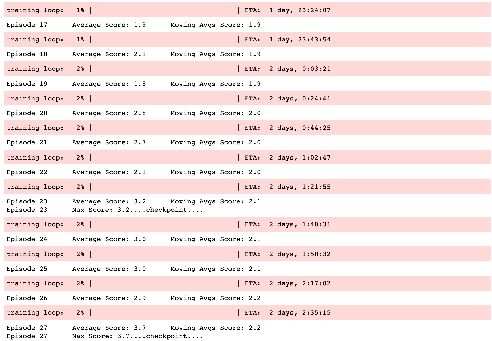

* 2 The model converges very slowly too.  So I would try to reduce the number of layers.

|  NN       |   fc1_units      | fc2_units   | fc3_units | output_layer |
|------------|------------------|-------------|-----------|--------------|
|  Actor     |  256             | 256         |  256      | 4            |
|  Critic    |  256             | 256         |  256      | 1            |

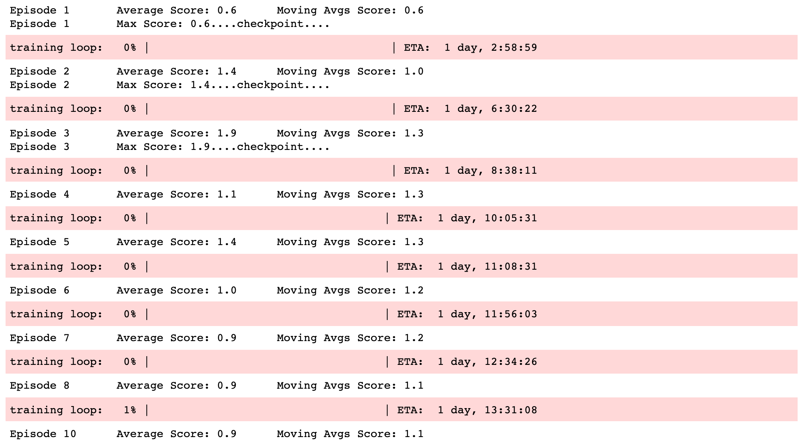

* 3 Overfitting is better than underfitting. So I config `fc1_units=1024`.The model's performance is much better than before, but it still converges slowly. I would reduce the number of units.

|  NN       |   fc1_units      | fc2_units   | - | output_layer |
|------------|------------------|-------------|-----------|--------------|
|  Actor     |  1024             | 512         |  -      | 4            |
|  Critic    |  1024             | 512         |  -      | 1            |

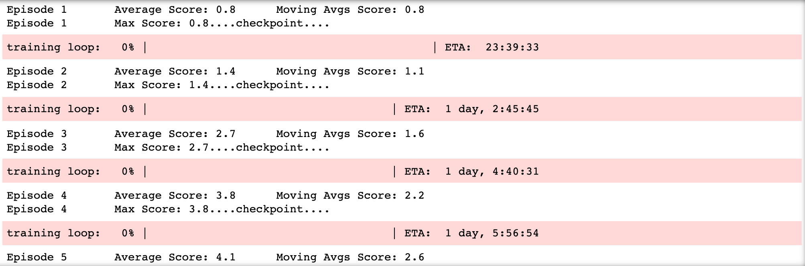

* 4 The model initially converged faster than it'd done before. When the episode exceeded 20, it converged very slowly. At the same time, I reduced the units on the Mac.

|  NN       |   fc1_units      | fc2_units   | - | output_layer |
|------------|------------------|-------------|-----------|--------------|
|  Actor     |  512             | 512         |  -      | 4            |
|  Critic    |  512             | 512         |  -      | 1            |

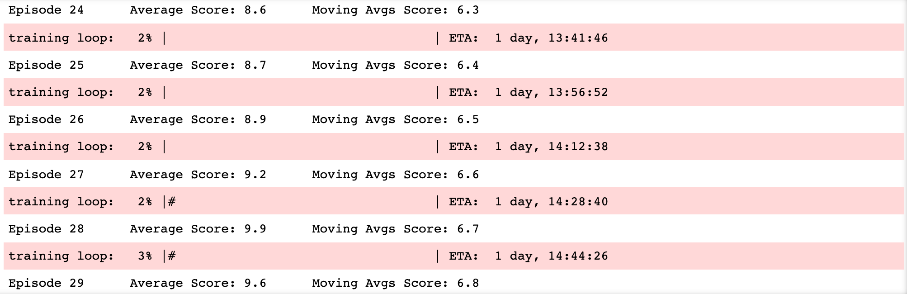

#### From Mac :
* 1 The performance was worse than before, I thought the model was underfitting.

|  NN       |   fc1_units      | fc2_units   | - | output_layer |
|------------|------------------|-------------|-----------|--------------|
|  Actor     |  256             | 256         |  -      | 4            |
|  Critic    |  256             | 256         |  -      | 1            |
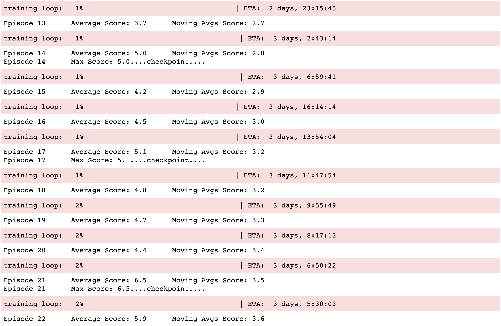

#### From Windows :

* 1 I thought I set the first layer and the second layer to 512 units. It's a good structure. But I needed to make the model converge faster. I noticed this description. So could `epsilon` be implemented here like in the DQN algorithm? 

`Select action at = µ(st|θµ) + Nt according to the current policy and exploration noise`

In the knowledge forum, I noticed that some students mentioned that this practice is very effective for model convergence. Indeed, epsilon's method of gradually reducing noise was very effective.

|  NN       |   fc1_units      | fc2_units   | EPSILON , EPSILON_DECAY| output_layer |
|------------|------------------|-------------|-----------|--------------|
|  Actor     |  512             | 512         |  1.0 , 1e-6     | 4            |
|  Critic    |  512             | 512         |  1.0 , 1e-6      | 1            |

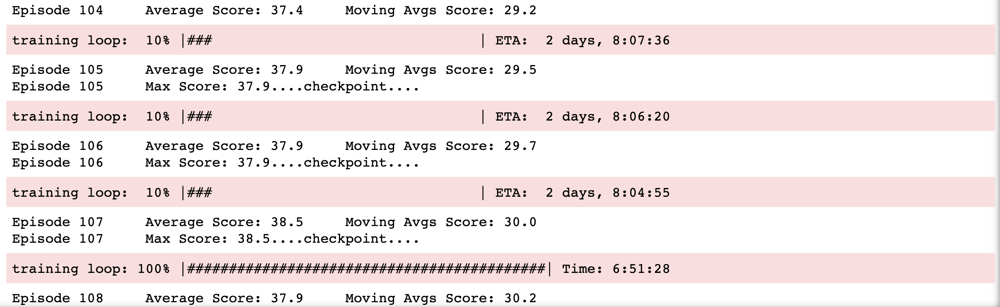

## Results

Hyperparameters:
```
BUFFER_SIZE = int(1e6)  # replay buffer size
BATCH_SIZE = 128        # minibatch size
GAMMA = 0.99            # discount factor
TAU = 1e-3              # for soft update of target parameters
LR_ACTOR = 1e-3         # learning rate of the actor
LR_CRITIC = 1e-3        # learning rate of the critic
WEIGHT_DECAY = 0        # L2 weight decay
EPSILON_DECAY = 1e-6    # epsilon decay
EPSILON = 1.0           # exploration actions space
LEARN_INTERVAL = 20     # learning 10 times per 20 timesteps   
LEARN_TIMES = 10   
```

Model Structure
|  NN       |   fc1_units      | fc2_units   | EPSILON , EPSILON_DECAY| output_layer |
|------------|------------------|-------------|-----------|--------------|
|  Actor     |  512             | 512         |  1.0 , 1e-6     | 4            |
|  Critic    |  512             | 512         |  1.0 , 1e-6      | 1            |


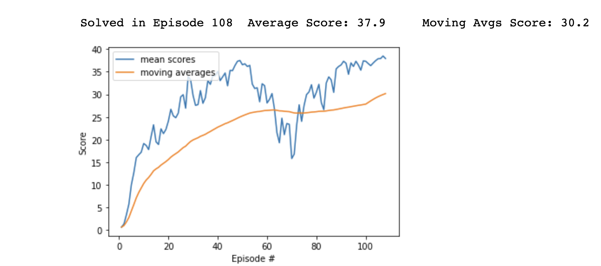

## Conclusion
The number of FC units will affect the performance of agents. The  epsilon and batch-normalization technology is very helpful for training model.

<div align="center">

</div>
<div align="center">
<u> **Figure 6** </u>: **Watch smart the agent**<br>
</div>

## Future enhancements
- Implement "(Optional) Challenge: Crawl". 
- Explore Distributed Distributional Deterministic Policy Gradients ([D4PG](https://openreview.net/forum?id=SyZipzbCb)) and Proximal Policy Optimization ([PPO](https://openai.com/blog/openai-baselines-ppo/)).
